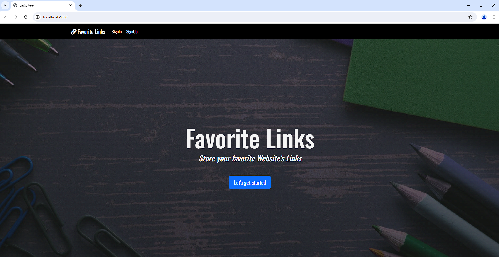
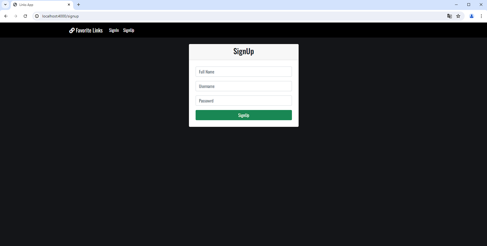
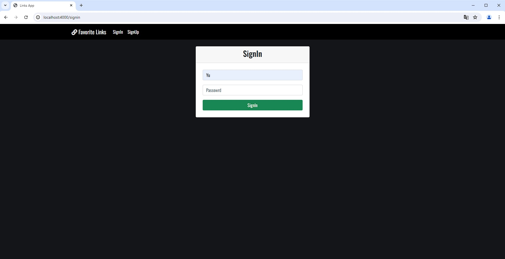
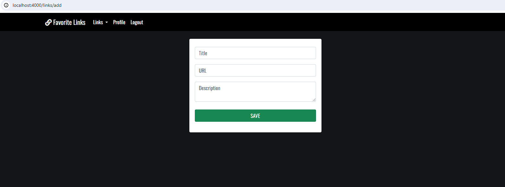

## My favorite links Web app 

Web app made using express as a backend framework to implement Authentification, routes protection and CRUD instructions to manage the links saved for each user in this web site. Additionally use MySQL as a database engine to save all the data for the users, including his username and their password (encrypted using a hash method)




#### It includes a SignUp page to register new users.



#### And a SignIn page to log in the registered users.

Additionally use flash messages to show the status, success events and errors to the users for a better UX.

#### Users can add new links to only see by themselfs.


To use this proyecto you will need to establish the parameters of database connection in the 'keys.js' file and also run the command
```shell
npm install
```

*This is a project for educational purposes, builded to learn the fundamentals of the creating web apps and the basic requirements.*  

*The original creator is 'Fazt' and the link of the original project and video is:*
https://www.youtube.com/watch?v=qJ5R9WTW0_E
